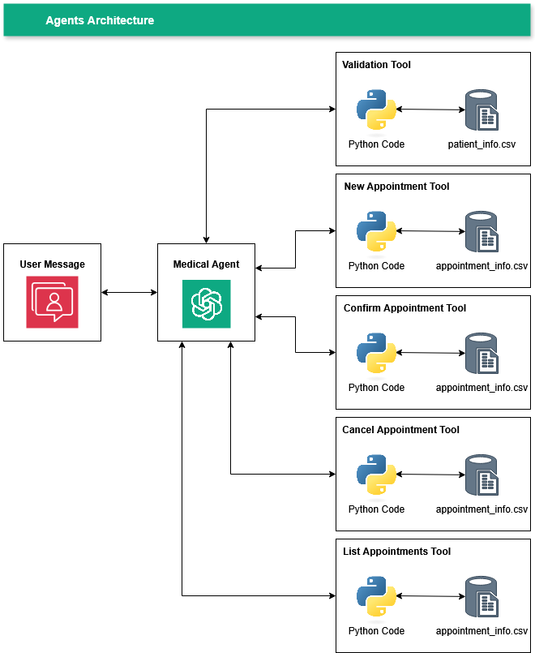
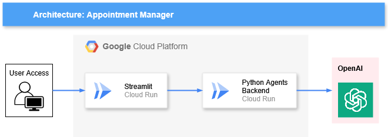

# Appointment Manager – Conversational AI Back-End Service

---

## Introduction

**Appointment Manager** is a back-end service designed to help patients manage their medical appointments through a secure, conversational interface. This project, built with Python, **FastAPI**, and the **LangChain / LangGraph** ecosystem, implements a simple **ReAct agent** that intelligently guides patients through identity verification before granting access to appointment management functions.

The primary goals are to:
- **Securely verify a patient's identity** using their personal details to prevent unauthorized access.
- **Provide core appointment management functions**, including scheduling, listing, confirming, and canceling appointments.
- **Leverage a tool-using AI agent** to create a natural and flexible conversational flow, allowing patients to switch between tasks seamlessly.

This repository contains the complete source code for the FastAPI service, the Streamlit demonstration front-end, and the conversational agent.

---

## Features

-   **Secure Identity Verification**: A mandatory first step where the assistant uses a dedicated tool to verify the patient's identity via their **full name**, **phone number**, and **date of birth**.
-   **Comprehensive Appointment Management**: Once verified, patients have access to a suite of tools to manage their appointments:
    -   **Schedule New Appointment**: Book a new appointment with a specified doctor, date, and time.
    -   **List Appointments**: Retrieve a complete list of their scheduled and confirmed appointments.
    -   **Confirm an Appointment**: Formally confirm their attendance for an upcoming appointment.
    -   **Cancel an Appointment**: Cancel an existing appointment.
-   **ReAct Agent Logic**: The conversation is not driven by rigid scripts but by a smart agent that can reason about the user's intent, select the appropriate tool, and execute it.
-   **File-Based Data Persistence**: Patient and appointment data are managed in `.csv` files using the `pandas` library, making the project self-contained and easy to run.
-   **Separate Front-End and Back-End**: The system is decoupled into a FastAPI back-end service and a Streamlit front-end, which is a robust pattern for scalable applications.

---

## Web App / Demo

To demonstrate the back-end's capabilities, a simple conversational interface has been developed using **Streamlit** at Google Cloud. This allows for easy testing and interaction with the appointment agent.

The code for this front-end can be found in the `solution/streamlit/` directory.

URL: https://streamlit-app-v2-928440534161.us-east1.run.app

---

## System Architecture

The project is built on a modern, decoupled architecture that separates the AI logic, the API service, and the user interface, all deployed on **Google Cloud Platform (GCP)**.

### Software & Logic Architecture (LangGraph ReAct Agent)

The core of the system is a **ReAct (Reason+Act) agent** created using the `langgraph.prebuilt.create_react_agent` function. This design allows the LLM to intelligently orchestrate the conversation by "thinking" step-by-step and choosing the right tool for the job.

1.  **User Input**: The user sends a message (e.g., "I need to check my appointments").
2.  **ReAct Agent**: The agent, powered by the `gpt-4.1-mini` model, receives the input.
3.  **Reasoning (Thought Process)**: The LLM analyzes the user's intent and the conversation history. It decides which tool, if any, is needed. For a new conversation, its primary instruction is to use the validation tool.
4.  **Action (Tool Selection)**: The agent selects one of the available tools:
    -   `_validation_tool`
    -   `_new_appointment_tool`
    -   `_list_appointment_tool`
    -   `_confirm_appointment_tool`
    -   `_cancel_appointment_tool`
5.  **Execution & Observation**: The selected Python function is executed (e.g., `list_appointment` queries the `appointments_info.csv` file). The result (a success message, an error, or data) is returned to the agent.
6.  **Response Generation**: The agent observes the tool's output and generates a final, human-readable response to the user. This cycle repeats for each turn of the conversation.

<p align="center">
  
</p>

### Deployment Architecture (Google Cloud Platform)

The service is deployed on **Google Cloud Platform (GCP)** as two separate, containerized applications.

1.  **Backend Service (FastAPI on Cloud Run)**: The FastAPI application is containerized with Docker and deployed on **Cloud Run**. This serverless platform automatically handles scaling, ensuring the API is both robust and cost-effective.
2.  **Frontend Service (Streamlit on Cloud Run)**: The Streamlit web app is also containerized and deployed on **Cloud Run**, providing a publicly accessible and scalable user interface.
3.  **Data Storage (`.csv` files)**: For this implementation, data is stored in CSV files packaged within the backend container. For a production environment on GCP, this would be migrated to a service like **Cloud SQL** or **Firestore**.

<p align="center">
  
</p>

---
## Project Structure
```
├── .env                    # Environment variables for local development
├── sandbox.ipynb           # Jupyter Notebook for experimentation and testing
│
├── data/                   # Default datasets used by the backend
│   ├── appointments_info.csv
│   └── patients_info.csv
│
├── img/                    # Contains architecture diagrams
│   ├── agents_architecture.png
│   └── app_architecture.png
│
└── solution/               # Main application source code
├── backend/            # The FastAPI back-end service
│   ├── .env            # Environment variables specific to the backend
│   ├── agents.py       # Core conversational agent logic (LangGraph ReAct)
│   ├── Dockerfile      # Docker configuration for the backend
│   ├── main.py         # FastAPI application entry point
│   └── requirements.txt
│
└── streamlit/          # A simple front-end for demonstration
├── app.py          # The Streamlit application script
├── Dockerfile      # Docker configuration for Streamlit
└── requirements.txt
```

---

## Setup and Installation

To run this project locally, you will need to run both the back-end and front-end services.

### Backend (FastAPI)

1.  **Navigate to the backend directory**:
    ```bash
    cd solution/backend
    ```
2.  **Set up a virtual environment** and install dependencies:
    ```bash
    python -m venv venv
    source venv/bin/activate
    pip install -r requirements.txt
    ```
3.  **Configure environment variables**:
    - Create a `.env` file inside `solution/backend/` and add your OpenAI API key:
      ```
      OPENAI_API_KEY="your_openai_api_key_here"
      ```
4.  **Run the FastAPI server**:
    ```bash
    uvicorn main:app --reload --port 8000
    ```
    The backend API will now be running at `http://127.0.0.1:8000`.

### Frontend (Streamlit)

1.  **Navigate to the frontend directory** in a **new terminal**:
    ```bash
    cd solution/streamlit
    ```
2.  **Set up a virtual environment** and install dependencies:
    ```bash
    python -m venv venv
    source venv/bin/activate
    pip install -r requirements.txt
    ```
3.  **Important**: You must update the backend URL in `solution/streamlit/app.py`. For local testing, change the URL in the `get_response` function to your local FastAPI server:
    ```python
    # In app.py
    response = requests.post("[http://127.0.0.1:8000/get_answer/](http://127.0.0.1:8000/get_answer/)", json=post_data).json()
    ```
4.  **Run the Streamlit app**:
    ```bash
    streamlit run app.py
    ```

---

## Usage

1.  Ensure both the **backend** and **frontend** servers are running as described above.
2.  Open your web browser and navigate to the URL provided by the Streamlit command (usually `http://localhost:8501`).
3.  Interact with the chatbot in the web interface.
4.  You can also view the backend's interactive API documentation at `http://127.0.0.1:8000/docs`.

---

## Technical Decisions and Assumptions

-   **FastAPI**: Chosen for its high performance, asynchronous support, and automatic generation of OpenAPI documentation, which is ideal for API development.
-   **LangGraph (`create_react_agent`)**: This pre-built ReAct agent was selected because it provides a powerful and flexible way to create tool-using agents. It allows the LLM to handle the complex reasoning of conversation flow, which is more dynamic than a hard-coded state machine.
-   **Pandas & CSV**: Chosen for data persistence due to its simplicity. It makes the project self-contained and removes the need for an external database setup, which is ideal for a focused exercise.
-   **Streamlit**: Selected for its ability to rapidly create interactive and aesthetically pleasing data apps and demos with minimal code.

---

## Future Work and Improvements

-   **Database Migration**: The most critical next step is to replace the CSV file-based storage with a robust, production-grade database like **PostgreSQL** or **MongoDB** to handle concurrent requests and ensure data integrity.
-   **Robust State Management**: For stricter security and flow control, the ReAct agent could be replaced with a custom **LangGraph state machine**. This would enforce that a user is in a `verified` state before the appointment tools can even be called.
-   **Enhanced Error Handling**: Implement more specific error handling in the tools. For example, provide clearer feedback to the user if they provide a date in the wrong format or try to book an appointment in the past.
-   **User Session Management**: Implement proper user sessions to handle conversations from multiple users simultaneously without mixing up their data or verification status.
-   **Comprehensive Testing**: Build out a suite of unit and integration tests to validate the behavior of each tool and the overall agent logic.
-   **Guardrails**: Add a dedicated layer to ensure system safety and reliability. This includes preventing model hallucinations, validating user inputs to block malicious prompts, and restricting the agent from discussing out-of-scope topics.